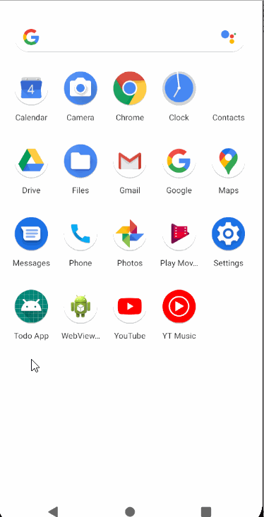
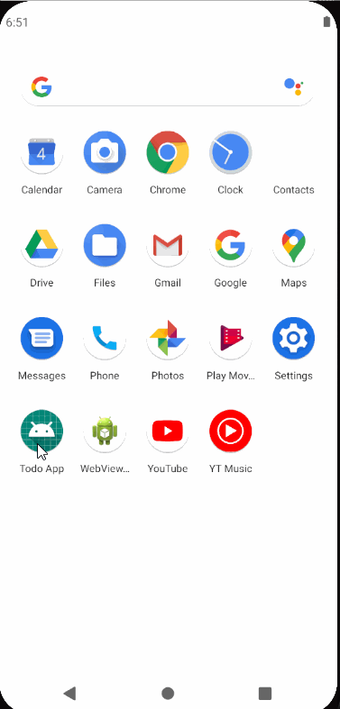
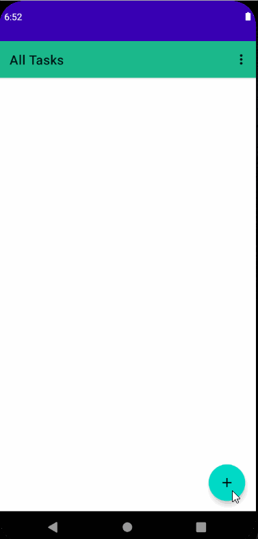
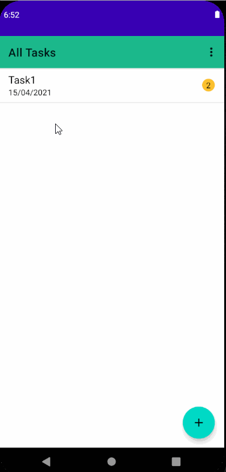
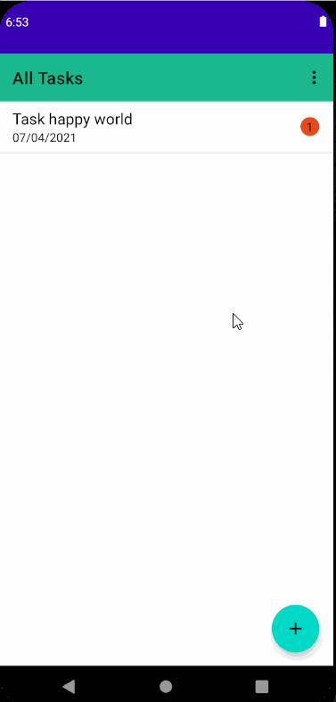
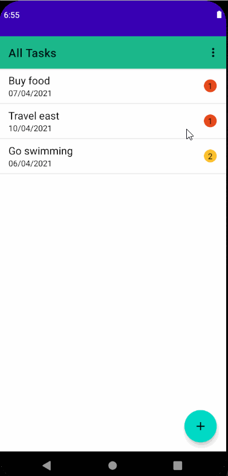
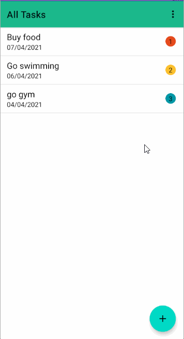
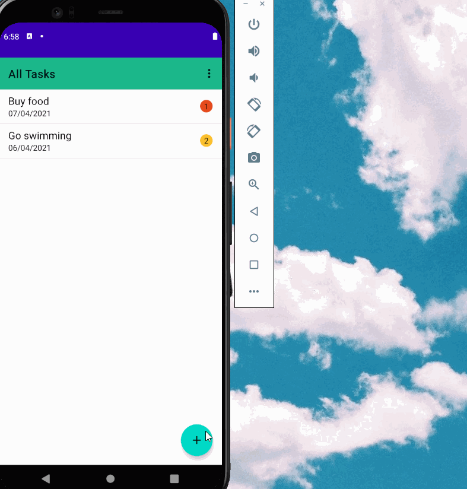

## Simple todo app

This is a simple todo application that can add, delete and update tasks.

### App demo
A short demo of the app

### Starting screen (Splash activity)
On clicking the app, a screen showing app logo appears.

### Add task
Task can be added by clicking on the + button. Another activity starts where we can set task properties. Task must have a title name, priority and due date.

### Update task
Existing task can be updated by clicking on the task. Another activity starts where we can update task properties.

### Delete task
Task can be deleted either by swiping or by clicking the task and clicking delete button. A dialog box appears to confirm user choice.

<table>
<tr><td>By swiping</td>
<td>By clicking on the task</td>
</tr>
<tr>
<td></td>
<td></td>
</tr>
</table>

### Delete all tasks at once
All tasks can be deleted by going to the menu and clicking delete all option.

### Save data on rotation
Data is lost on rotation if not saved before. This app supports data save and restore on rotation

